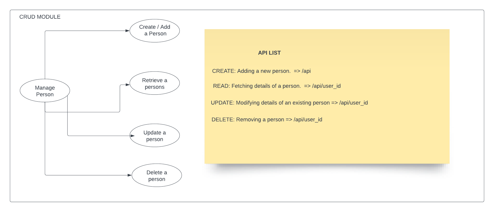

# Docs

CRUD operation.
REST API capable of CRUD operations on a "person" resource, interfacing with any database of your choice.

These docs describe how to use the [CRUD](https://github.com/Nierowheezy/backend-task.git)API. We hope you enjoy these docs.

# How to run

clone the repo and `run npm i`
run npm start to start the server locally
the API runs on port 5000 locally
you can swap the db config to your local db, check the root of the app for the db config
you can test the api end points using any testing software of your choices

## API USAGE

Database Modelling:
UML Diagram: 

## API USAGE

To use crud api an API See the list of available endpoints.

`get a list persons`
`get a single person`
`update a person`
`delete a person`

see sample below endpoints below.

```http
GET     https://backend-task-wz1u.onrender.com/api
GET     https://backend-task-wz1u.onrender.com/api/user_id
POST    https://backend-task-wz1u.onrender.com/api
UPDATE  https://backend-task-wz1u.onrender.com/api/user_id
DELETE  https://backend-task-wz1u.onrender.com/api/user_id
```

| Verb     | API           |
| :------- | :------------ |
| `GET`    | `api`         |
| `GET`    | `api/user_id` |
| `POST`   | `string`      |
| `UPDATE` | `api/user_id` |
| `DELETE` | `api/user_id` |

| Parameter | Type     | Description           |
| :-------- | :------- | :-------------------- |
| `user_id` | `string` | **Required**. User Id |

## Responses

Sample API respsonse for a successful get request list of persons

```javascript
[
  {
    _id: 1,
    Name: "Mark Essien",
  },
];
```

Sample API respsonse for a successful get request single person

```javascript
  {
    _id: 1,
    Name: "Mark Essien",
  },
```

Sample API respsonse for a successful post request

```javascript
{
    "id": 1,
    "Name": "Mark Essien"
}
```

The `success` attribute describes if the transaction was successful or not.

## Status Codes

Gophish returns the following status codes in its API:

| Status Code | Description             |
| :---------- | :---------------------- |
| 200         | `OK`                    |
| 201         | `CREATED`               |
| 400         | `BAD REQUEST`           |
| 404         | `NOT FOUND`             |
| 500         | `INTERNAL SERVER ERROR` |
